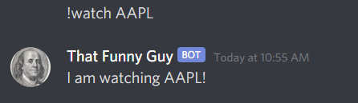

I decided I wanted to build something to help me with investments and such. Something else I decided is that this might be a great opportunity to write some _real world_ code: from the concept until deployment.

For this project, we will design and program a **Discord Bot** that will _watch_ for stocks and warn me when it's time to _buy_ or _sell_ the asset. In order to do this, we are going to require some AWS services, namely DynamoDB, EC2, Lambda, Cloudwatch and a few others.

This is an ongoing project, what means some ideas and approaches might change with time. I hope you find it enjoyable and maybe even useful.

## Designing the Discord Bot

It's really simple to start a Discord Bot in Python. Start with `pip install discord.py`, create a `bot.py` file and add the code below in it.

```python
import discord
from discord.ext import commands

bot = commands.Bot(command_prefix="!")

@bot.event
async def on_ready():
    print(f"{bot.user} has connected to Discord!")

if __name__ == '__main__':
    bot.run("MY_TOKEN")
```

but you have to change the `"MY_TOKEN"` string for your real token before running it! For more about discord bots and their tokens, I recommend [this real python tutorial](https://realpython.com/how-to-make-a-discord-bot-python/). The current bot does nothing, however, so let's start thinking about somethings that'd be nice to have:

```python
@bot.command(name="watch", brief="add symbol to table")
async def add_watch_entry(ctx, symbol):
    await ctx.send(f"I am watching {symbol}!")


@bot.command(name="unwatch", brief="remove symbol from table")
async def remove_watch_entry(ctx, symbol):
    await ctx.send(f"I am not watching {symbol} anymore.")


@bot.command(name="watching", brief="show all symbols under watch")
async def show_all_watch_entries(ctx):
    await ctx.send("Watching Table: ...")
```

With the three lines above I am starting to implement a simple **create, read, delete** application. If you run the `.py` script again and type something like `!watch AAPL`, you shall be responded with a `I am watching AAPL!`. This bot is a liar though, for it does nothing what it says it's doing! In the next part, we will connect it to a real Database.

## Create, Read, Delete with AWS DynamoDB

The simplest way to use AWS services in python is by installing `boto3` or `botocore`. These are wrappers around the `AWS CLI` that simplify a lot our development. Just do `pip install boto3` and you're all set. After we have it installed we can instantiate the DynamoDB resource with

```python
import boto3

dynamodb = boto3.resource('dynamodb')
table = dynamodb.Table('bot')
```

With the snippet above, we connect to AWS and then to the DynamoDB table (although it's a lazy connection). You must have your AWS credentials at `~/.aws/credentials` for this to work. Otherwise, you can pass `aws_access_key_id` and `aws_secret_access_key` as parameters in `boto3.resource`.

DynamoDB is a simple use NoSQL Database service that has a permanent Free Tier for Free Tier enabled AWS accounts. It gives you 25Gb of space and some read and write capacity with no cost. That's why we'll be using it. Let's now update the bot commands.

```python
@bot.command(name="watch", brief="add symbol to table")
async def add_watch_entry(ctx, symbol):
    response = table.put_item(
        Item={"symbol": symbol}
    )

    if response['ResponseMetadata']['HTTPStatusCode'] == 200:
        await ctx.send(f"I am watching {symbol}!")
    else:
        await ctx.send(response)


@bot.command(name="unwatch", brief="remove symbol from table")
async def remove_watch_entry(ctx, symbol):
    response = table.delete_item(
        Item={"symbol": symbol}
    )

    if response['ResponseMetadata']['HTTPStatusCode'] == 200:
        await ctx.send(f"I am not watching {symbol} anymore.")
    else:
        await ctx.send(response)


@bot.command(name="watching", brief="show all symbols under watch")
async def show_all_watch_entries(ctx):
    response = table.scan(Limit=1000)

    embed = discord.Embed(title="watching table").add_field(name="id", value="symbol")
    for i, item in enumerate(response["Items"]):
        embed.add_field(name=str(i), value=item["symbol"])

    await ctx.send(embed=embed)
```

These methods lack validation, but they are sure enough to get us started and, in my opinion, there is no need to overengineer this. However, one crucial piece is still missing here: creating the DynamoDB table!

## Creating an AWS DynamoDB Table with Terraform

DynamoDB simplifies a lot of work when dealing with databases in general, but we still must create our table before we can use it. For this, I'll use Terraform, a infrastructure-as-code framework that let you start using AWS services without the intimidation that the AWS console can create.

In order to use terraform, you must install it in your computer first. [Here you can find tutorials on how to do this](https://www.terraform.io/downloads.html). After you've it installed, lets create a new `main.tf` file.

```t
terraform {
  required_providers {
    aws = {
      # uses the latest provider from hashicorp registry
      source = "hashicorp/aws"
    }
  }
}

provider "aws" {
  # looks for credentials in ~/.aws/credentials
  profile = "default"
  # N. Virginia
  region = "us-east-1"
  version = "~> 3.6.0"
}

variable "tags" {
  type = map(string)
  default = {
    "project" = "lincoln"
    "owner"   = "pedro valois"
  }
}
```

The snippet above does nothing but tell terraform we are going to use AWS as our cloud provider. As you can see, I created a variable named "tags": this is a good practice when using AWS as you can use a tag to easily group related resources. Now, can start adding AWS resources in `main.tf`.

```t
resource "aws_dynamodb_table" "input_dynamodb_table" {
  name             = "bot"
  billing_mode     = "PROVISIONED"
  stream_view_type = "KEYS_ONLY"
  stream_enabled   = true
  read_capacity    = 5
  write_capacity   = 5
  hash_key         = "symbol"

  attribute {
    name = "symbol"
    type = "S"
  }

  tags = merge(var.tags, {
    Name = "${var.tags.project}-dynamodb-table"
  })
}
```

With our `.tf` file ready, go to the terminal and type `terraform init`. This is going to prepare the environment based on the chosen cloud provider. After it's finished, just do `terraform apply`: This command is going to execute `terraform plan` first, that shows which resources are going to be added, and ask if you agree with the changes. You should read through it and enter `yes` if nothing looks wrong. It will start provisioning the DynamoDB Table and it's going to tell you when it's finished.

## Testing the bot

<!-- <Folder commit="link" /> -->

Our bot and database are production ready! I put all of my bot code in a `bot.py` file. Just go to the terminal and execute `python bot.py`, wait for a while, and you'll see the `on_ready` method message print something into the console. This means our bot is ready to receive messages in the channels you invited it to. Now, just go there and try it!



I won't deploy the bot to production yet as this requires setting at least an EC2 instance. We are going to do this later, but I think it's enough for the first part. Hope you enjoyed it!