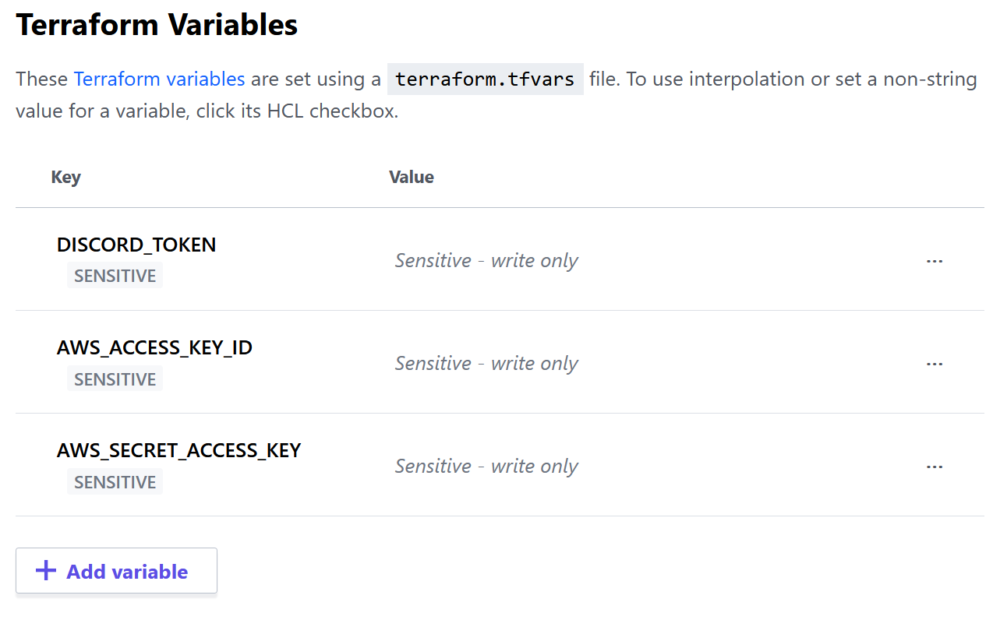
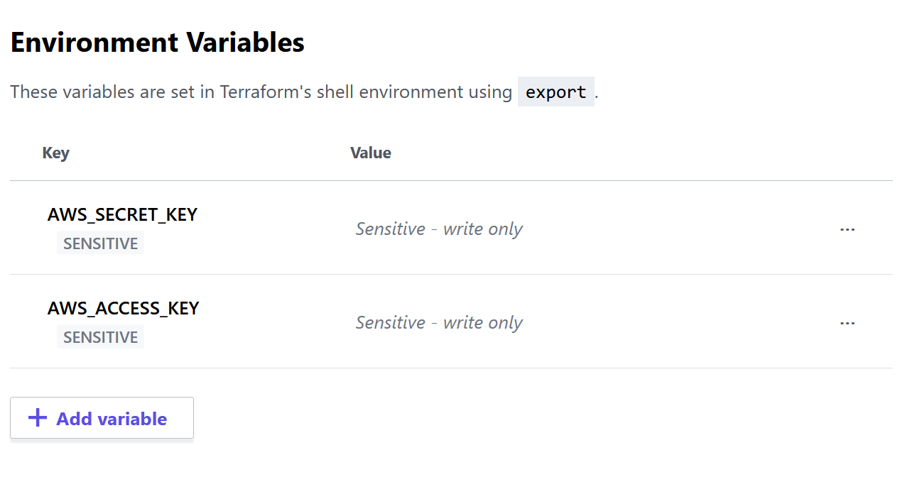

In this part we are going to effectively deploy the bot in AWS so that we don't need to run it locally anymore.

## Dealing with Sensitive Information

The Discord Token is the kind of information that can be considered sensitive. A common approach for dealing with this is by using environment variables and a great tool for both development and production stages is `python-decouple`. We can get it ready in 3 simple steps:

1. `pip install python-decouple`
2. create a `.env` file
    ```log
    DISCORD_TOKEN=ABC123
    ```
3. remove the token from `bot.py`
    ```python
    if __name__ == '__main__':
        TOKEN = config("DISCORD_TOKEN")
        bot.run(TOKEN)
    ```

## Deploying the Discord Bot to AWS EC2

The Discord Bot stays alive through WebSocket, what means we cannot deploy it in a reactive service such as Lambda. Therefore, we will deploy it to the AWS Elastic Compute Cloud using Terraform. As a first action, let's split the python code from the infrastructure code by putting all `.tf` files in a `deploy` directory.

AWS EC2 is a virtual computing environment, meaning we need to define a templated Amazon Machine Image to work on. For simplicity reasons, let's use a Ubuntu Serve AMI that comes with Python pre-installed. By using the `aws_ami` data source, we can "easily" fetch the AMI ID.

```t
data "aws_ami" "ami" {
  most_recent = true
  owners = ["099720109477"]

  filter {
    name   = "name"
    values = ["ubuntu/images/hvm-ssd/ubuntu-focal-20.04-amd64-server-*"]
  }
}
```

With that, we can create a `aws_instance` resource that's going to host our bot. The `aws_instance` accepts a `user_data` parameter that we can use to configure and start the application.

```t
variable "DISCORD_TOKEN" {}
variable "AWS_ACCESS_KEY_ID" {}
variable "AWS_SECRET_ACCESS_KEY" {}

resource "aws_instance" "discord_bot" {
  ami           = data.aws_ami.ami.id
  instance_type = "t2.micro"
  user_data = <<EOF
#!/usr/bin/bash
sudo apt-get update -y
sudo apt-get install python3-pip -y

git clone https://github.com/phvv-me/lincoln.git

export DISCORD_TOKEN=${var.DISCORD_TOKEN}
export AWS_ACCESS_KEY_ID=${var.AWS_ACCESS_KEY_ID}
export AWS_SECRET_ACCESS_KEY=${var.AWS_SECRET_ACCESS_KEY}
export AWS_DEFAULT_REGION=us-east-1

python3 -m pip install -r lincoln/requirements.txt
python3 lincoln/bot/main.py
EOF

  tags = merge(var.tags, {
    name = "${var.tags.project}-ec2-instance"
  })
}
```

Notice we set the `DISCORD_TOKEN`, `AWS_ACCESS_KEY_ID` and `AWS_SECRET_ACCESS_KEY` environment variables as an empty variable in terraform configuration. This means terraform is going to ask for its value when running `terraform apply`. 

## Configuring the Terraform Cloud

The process of retyping those credentials in every deploy can surely get exhausting, but we can configure a workspace in terraform cloud in order to skip this step. 

1. access [https://app.terraform.io/session][app.terraform.io] and create your free account
2. click in **workspaces** and then in **+ New workspace**
3. Select **CLI-driven workflow**
4. Give a name to your new workspace
5. Copy the snippet that showed up and paste it in `main.tf` inside the `terraform` block. It should look like this
    ```t
    terraform {
        required_providers {
            aws = {
                source = "hashicorp/aws"
            }
        }
        backend "remote" {
            organization = "{your organization name}"

            workspaces {
            name = "{your workspace name}"
            }
        }
    }
    ```
6. Click on **Variables**
7. Add `DISCORD_TOKEN`, `AWS_ACCESS_KEY_ID` and `AWS_SECRET_ACCESS_KEY` as **Terraform Variables** marking them as **Sensitive**.
    
8. Add `AWS_ACCESS_KEY` and `AWS_SECRET_KEY` as **Terraform Environment Variables** marking them as sensitive (you can use the same values as before if they have a broad set of permissions because they will perform resource creation).
    

Now you can just run `terraform apply` and in a few minutes you shall have your bot waiting for your orders in discord again.

