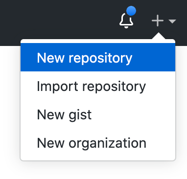
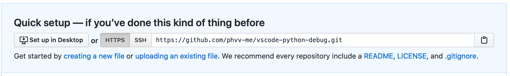
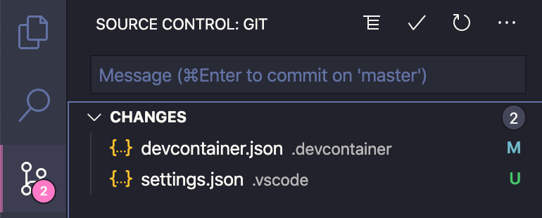
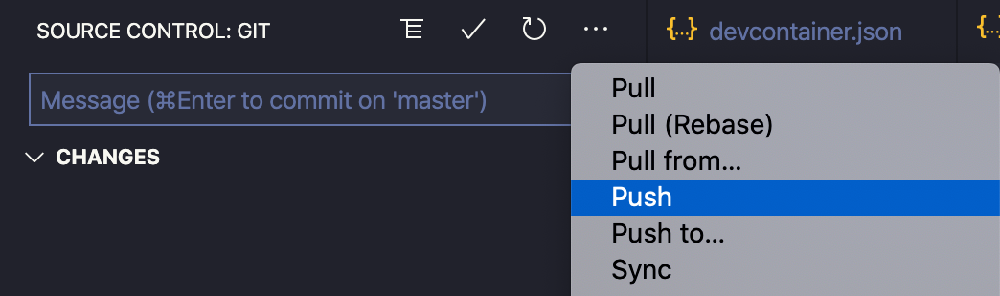
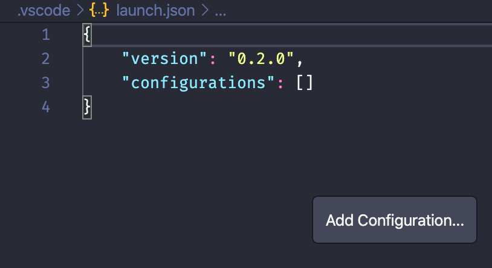
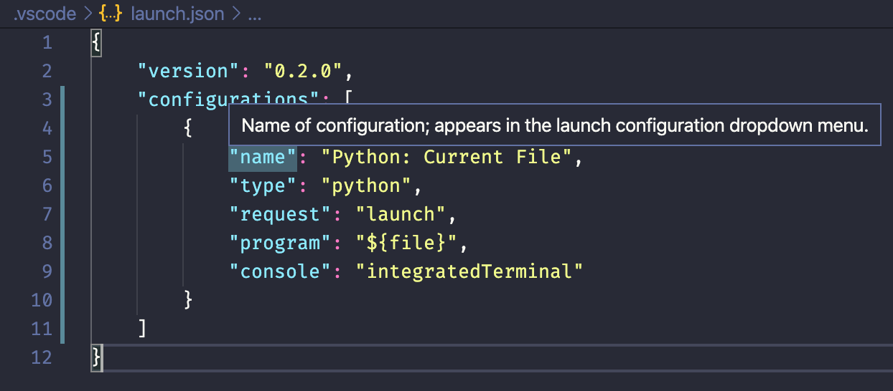
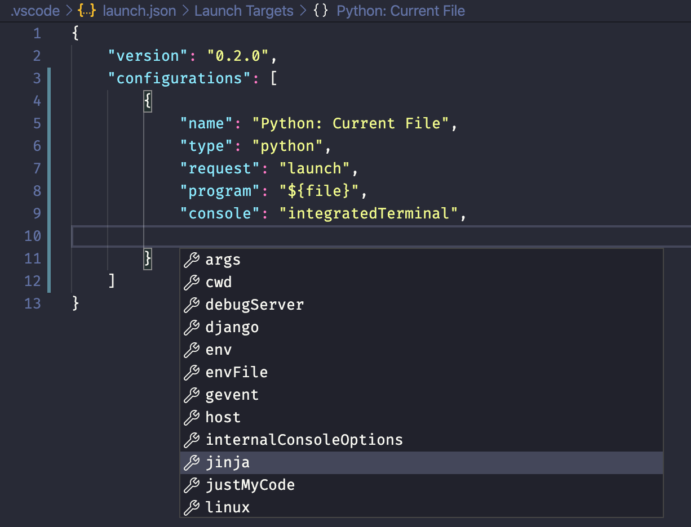

<!-- review keywords -->
<!-- link to github -->

Debugging is a essential task as a developer and learning the different available debugging tools are a good way to understand more how to do it properly.

This tutorial is focused around the idea of debugging as a must-do that may be needed in different situations. We start it talking about what is debugging and why you should be doing it. Furthermore, we will see how to perform it in python with `print()`, `breakpoint()`, `pdb` and vscode.

## Introduction

> "When debugging, novices insert corrective code; experts remove defective code." ~ **Richard E. Pattis**

### What is debugging?

As the name states, the act of debugging a computer program could be seen as _removing or fixing bugs_. In that sense, we could model the computer code as a car's engine and our job while debuggers would be to take out the insects infesting it. This is totally disconnected to the reality, because as a matter of fact, the engine and the bugs are the same things most of the time.

I believe a better model would be to see the computer code as any other human tool: it has one or more intents and mechanisms by which this intents are delivered.

Let's take that car again. A car has many intents: transporting people, carrying stuff around, moving forward, backward, some of them even flip. For these intents to be well delivered, the car has several tools: gas, mirrors, doors, engine, wheels and much more. Thus, all the tools have to be working **together** so that the intents can be perfectly fulfilled.

All right. What am I going for here? You'll get it in a minute.

Suppose now we own a car, we are driving the car and suddenly it stops. He tries to turn it back on. Not a sign. We say "it's broken". Besides the fear and anger when something like this happens, we know that it is just one of the car parts that stopped working. The frustrating thing in this kind of situation is that we don't have any tools for **investigating** what specifically broke. Then, we call insurance and take the car to the repair shop, because they have the necessary equipment, and they tell us our tank was filled with water! The horror!

Okay, I'm finished with my story. Now, what was the bug and what is debugging?

The bug is actually not the water. The bug is actually the limitation that cars have on fuel. The car industry _solves this bug_ by telling us not to put water in the car tank (and you thought you would be bad at debugging). Therefore, debugging was the actions the repair shop took to find the bug!

Every human-made tool has its **limitations** and it is impossible to fix them all. On the other hand, under some specific scope of intention that the tool has, we can surely make it work! In **programming** environments, _bugs_ would be all **unexpected behaviors** the _user_ finds, even though it did everything right. Hence **debugging** is the process seeing what is going on "inside" the program while it executes or at the moment it crashed.

### How Debugging will solve your problems?

As stated, debugging gives you a new power as a developer: the ability to investigate code inside-out. There are many common problems developers face daily that by harnessing debugging tools could be solved easier.

1. Understanding other people code
   - if you got to a project with an giant legacy codebase or can't grasp what a small script does, try **running the code in debugging mode** to figure out what is going on.
2. Finding bugs
   - this one confuses some people. Imagine you have a piece of code that as far as you know does its job right. If this is an important function, watching it **run in debugging mode** can lead you to insights on specific parts that could break everything and no one thought of it yet.
3. Optimizing code
   - With tools, such as a profiler, you can spot the bottlenecks in your code. On the other hand, debugging lets you investigate in real time why is it a bottleneck and might take you faster to the optimizations you have to do.
4. Learning
   - If you're new to some tool, language, protocol, process, codebase or wants to find out what is going on inside something, debugging will make you learn and understand it easier and faster than just reading it. Besides, it's more enjoyable.
5. Reverse Engineering
   - Debugging and reverse engineering have a lot in common. If you are interested in it, this could be a starting point!

### How Debugging will make you develop better?

What makes you a better developer? This has many answers, but I say it would be anything that gives you the **capacity to think before you code**. Debugging is all about that.

I believe this, because debugging is about collecting information and data before any action. Therefore, if you do good debugging, probably your code is going to be good as well.

Beyond that, it is a very general tool, that can be used in almost any situation. Personally, I see good debugging together with good testing as the swiss army knife (**image**) of software engineering.

### How Debugging will make you develop faster?

Sometimes the startup time the debugging tools have might fool us to think that filling our code with calls to `print()` would be faster. When you only insert a single `print()`, it might even be true, although this is hardly what happens. On most cases, marking your _breakpoints_ and pressing <kbd>F5</kbd> on vscode will be faster.

I confess that this is not really obvious at first and might not be true to all cases. Nevertheless, just like testing, debugging will lead to easier development in the long run and the easier you code, the faster you code.

Imagine that you are developing some app or program for quite sometime now and suddenly a strange bug starts to appear. You read your code fast, spot the problem and add some code to fix it. Does this reminds you of something? All right, if you keep doing this, you're actually building a card castle and it's going to fall sooner than you think.

When you keep making this _small fixes_, the real bugs are not being solved, for usually they are deeper than you can see. In due time you will start making more and more stops and then you will not be developing anything _new_ anymore. You'll be stuck with bugs you don't even understand how they are possible. Your code is now pure magic.

I know this sounds ridiculous and it should be. The point here is that if you never stop to review, test or **debug your code**, it is going to start making your development slower. As a rule of thumb, I'd say that if your code is over 400 lines total (considering all the files you wrote), you should start to think about it.

## Setting Up Visual Studio Code

Let's start this tutorial with a basic setup for VS Code. This is a very good yet simple configuration that I use in all my VS Code Python projects, as it configures the pep8 formatter, intellisense, the python interpreter version, github repo and some useful VS Code extensions. You don't have to follow _all_ the steps, but some are required, so if further on the reading you face any difficulties, come back here for troubleshooting. **The steps marked with _\*_ are not essential**.

I will show you now a simple and automatic way of setting up your environment with vscode and Docker: 

<!-- the first one is  and the second one is _more manual_, but still easy enough. I will _time_ how long does it take to perform each step, so you can choose the one you want to do easily. -->

<!-- TODO: second setup -->

### Setup with Remote Development extension pack

<!-- **13 - 27 minutes** -->

This a very useful VS Code extension created by Microsoft that let us develop inside docker containers. With this extension, we are able to download a pre-configured python project (even if we don't have Python installed in the computer). The only requirements are VS Code and Docker, but if you don't know anything about Docker, don't worry, for I will thoroughly instruct the Docker related steps. Besides, if you have a hard time with this step or want to know more about it, I do have a specific 
<Link to="/programming/vscode-docker-any-language/en-us/">Remote Development extension pack tutorial</Link> 
you can look.

#### 1. Install Docker on your computer

<!-- - what is docker? -->

##### Install Docker on Linux

1.  open the linux terminal (try <kbd>Ctrl</kbd> + <kbd>Alt</kbd> + <kbd>T</kbd> or look for it in the search bar)
2.  type the following commands:

    ```bash
    ❯ sudo apt-get update
    ❯ sudo apt-get install docker-ce docker-ce-cli containerd.io
    ```

3.  For detailed instructions, refer to the [official docker engine installation guide][docker engine installation guide].

[docker engine installation guide]: https://docs.docker.com/engine/install/

##### Install Docker on MacOS

1. download Docker Desktop (Stable) for MacOS clicking [here][docker installer].
2. Once it is downloaded, look for `Docker.dmg` file on Finder and click it.
3. For detailed instructions, refer to the [official documentation][vscode docker remote containers docs].

##### Install Docker on Windows

1. download Docker Desktop (Stable) for Windows clicking [here][docker installer].
2. Once it is downloaded, run the installer `Docker Desktop Installer.exe` file. You may need to restart your PC.
3. For detailed instructions, refer to the [official documentation][vscode docker remote containers docs].

[docker installer]: https://www.docker.com/products/docker-desktop
[vscode docker remote containers docs]: https://code.visualstudio.com/docs/remote/containers

#### 2. Install Remote Development extension pack

With Docker and Visual Studio Code installed, we just need the **Remote Development VS Code extension**. Click on the link below to go to the download page.

[link to remote development extension](https://marketplace.visualstudio.com/items?itemName=ms-vscode-remote.remote-containers)

#### 3. Start a new python project

Now that we have the extension, your VS Code interface might be a little bit different and you might see some new icons on the left sidebar. Now we will start a new vscode docker python project and this extension makes all the process very simple.

1. Click on the new symbol in the lower left corner. A dropdown list of options will appear.
2. Select **Remote-Containers: Try a Sample...** from the command list. A list of the available languages will be shown.
3. Choose **Python**. The screen will blink and start downloading the images to start your project.
4. This step may take from **5 to 15 minutes**. Wait for it to finish.
5. After the download is over, on VS Code, an **workspace** will be created with the project files.
6. If you have any doubts, **check the video below** to see each step exactly.

`video: title: "create vscode python project": ./videos/python.mov`

#### 4. Configuring your Python Development Environment\*

After the docker container has been created, you will see some files on the file explorer. We are now going to understand how these files configure our environment.

<!-- TODO: add image file explorer -->

##### Changing the Python version\*

On the file explorer, at the top, you will see the `.devcontainer` folder and inside it, the `devcontainer.json` file. This file is related to the **Remote Development VS Code extension** and is responsible for configuring the docker container.

1. Click on the `.devcontainer/devcontainer.json` file to open it.
   - This is a `.json` file. If you aren't familiar with it, it is just like a python `dict`.
2. On the _beginning_ of the file, you will find the `"VARIANT"` argument that settles the Python version.
   ```json
   {
     "args": { "VARIANT": "3.7" }
   }
   ```
3. Change the python version to `"VARIANT": "3.8"`.
4. Save the file with <kbd>Ctrl</kbd> + <kbd>S</kbd> or <kbd>⌘</kbd> + <kbd>S</kbd>.
5. Click on the button on the lower left corner that says **Dev Container: Python 3 Sample**. A dropdown will pop up.
6. Select **Remote-Containers: Rebuild Container** from the command list. VS Code will blink and it will start rebuilding the container. This will take about 5 minutes.
7. After the process is completed, open the vscode terminal with <kbd>Ctrl</kbd> + <kbd>\`</kbd> or <kbd>⌃</kbd> + <kbd>\`</kbd>. Assert it says `1: bash` on the select box at the upper right corner of the terminal window. This is the bash terminal of the linux docker container vscode has created.
8. type the following to see the updated python version.
   ```bash
   vscode@978bae730087:/workspaces/vscode-remote-try-python$ python --version
   Python 3.8.3
   ```
9. If you see `Python 3.8.x` on the output, congratulations, it has worked!
   - **obs.: some names might differ from my vscode container to yours! Not everything has to be the same.**

##### Changing vscode settings\*

VS Code has a collection of specific and extension related settings that we can enable or modify for a better developer experience. On the file explorer, at the top, you will see the `.devcontainer` folder and inside it, the `devcontainer.json` file.

1. Click on the `.devcontainer/devcontainer.json` file.
2. At the end of the file, we'll find the `extensions` array. Here it is possible to include vscode extensions to be installed in the container when it is created.
   ```json
   {
     "extensions": ["ms-python.python"]
   }
   ```
   - we see that the Microsoft `python` extension is already included. With it, many useful functionalities are added to `.py` and python related files, such as intellisense. Besides, now we are allowed to specify `python.` settings in vscode.
3. On the middle of `devcontainer.json`, we can see vscode `settings` that were installed when the container was created
   ```json
   {
     "settings": {
       "terminal.integrated.shell.linux": "/bin/bash",
       "python.pythonPath": "/usr/local/bin/python",
       "python.linting.enabled": true,
       "python.linting.pylintEnabled": true,
       "python.formatting.autopep8Path": "/usr/local/py-utils/bin/autopep8",
       "python.formatting.blackPath": "/usr/local/py-utils/bin/black",
       "python.formatting.yapfPath": "/usr/local/py-utils/bin/yapf",
       "python.linting.banditPath": "/usr/local/py-utils/bin/bandit",
       "python.linting.flake8Path": "/usr/local/py-utils/bin/flake8",
       "python.linting.mypyPath": "/usr/local/py-utils/bin/mypy",
       "python.linting.pycodestylePath": "/usr/local/py-utils/bin/pycodestyle",
       "python.linting.pydocstylePath": "/usr/local/py-utils/bin/pydocstyle",
       "python.linting.pylintPath": "/usr/local/py-utils/bin/pylint"
     }
   }
   ```
   - `autopep8`, `black` and `yapf` are formatting tools. `autopep8` is the vscode default value.
   - `bandit`, `flake8`, `mypy`, `pycodestyle`, `pydocstyle` and `pylint` are python linters. `pylint` is enabled as you can see through <i>`"python.linting.pylintEnabled": true`</i>.
4. Let us now change these settings. At the `.vscode` folder, create a new `settings.json` file.
   - we could change the settings at `devcontainer.json`, but for them to take effect, a container rebuild would be necessary at every change. We will avoid it here.
5. Click on the `.vscode/settings.json` file to open it.
   - at `settings.json`, we can specify vscode local settings for the **workspace**.
6. Add the lines below to modify a few settings.
   ```json
   {
     "python.formatting.provider": "black",
     "editor.formatOnSave": true,
     "files.autoSave": "onFocusChange",
     "python.linting.banditEnabled": true
   }
   ```
   - <i> `"python.formatting.provider": "black"` </i>: we change the default formatter to `black`.
   - `"editor.formatOnSave": true`: every time a file is saved, it is automatically formatted.
   - `"files.autoSave": "onFocusChange"`: the files are automatically saved when the _editor focus_ changes (changing files, move tabs, etc.)
   - <i> `"python.linting.banditEnabled": true` </i>: the `bandit` linter is enabled.
     > **Attention:** Notice that many linters can be `enabled`, but only one formatter can be the `provider`.
7. Save the `settings.json` file. For now on, these settings are enabled. If you want to change any other settings, just edit this file.

##### Configuring git and github repo\*

A crucial part of virtually **all** programming projects is **version control**. When you start your **Python Container Project**, a `git` repository will be cloned (the `.git` folder is hidden by default) from github. However, its `remote` repo is owned by Microsoft, what means we cannot change it. This step will help you _create a new github repo, tell your project to point to it and push your files there_.

1. Create the github repo.
   1. Head over to [github](https://github.com/).
   2. **Sign Up** if you don't have a github account, or **Log In** if you do.
   3. On the upper right corner, you will se a ➕ (plus) sign. Click on it and then on `new repository` (or just [click here](https://github.com/new)).
      
   4. Fill in the new repository form as you like.
      - if you add a `LICENSE` or `README.md` file, you'll need to do some _git conflict resolution_ later on as the current project already has these files.
   5. Click on the `Create repository` button.
   6. At the new screen, on the middle, you'll see a link to the repo you just created. Copy it.
      
2. With our new repo link copied, go back to vscode and open the terminal with <kbd>Ctrl</kbd> + <kbd>\`</kbd> or <kbd>⌃</kbd> + <kbd>\`</kbd>.
   1. At the terminal, assert you're at the project root folder. You can do this by typing `ls`. You should see the project files.
      ```bash
      vscode@978bae730087:/workspaces/vscode-remote-try-python$ ls
      LICENSE  README.md  app.py  requirements.txt  static
      ```
   2. Now, git repos have what is called a _remote repo_. We can see the current remote repo with `git remote -v`.
      ```bash
      vscode@978bae730087:/workspaces/vscode-remote-try-python$ git remote -v
      origin  https://github.com/Microsoft/vscode-remote-try-python (fetch)
      origin  https://github.com/Microsoft/vscode-remote-try-python (push)
      ```
   3. It is pointing to a Microsoft owned repo. To change it simply type <i>`git remote set-url origin {your-url-here}`</i>, where `{your-url-here}` should be exchanged with the link you had copied. After it, check the change with `git remote -v` again.
      ```bash
      vscode@978bae730087:/workspaces/vscode-remote-try-python$ git remote set-url origin https://github.com/phvv-me/vscode-python-debug.git
      vscode@978bae730087:/workspaces/vscode-remote-try-python$ git remote -v
      origin  https://github.com/phvv-me/vscode-python-debug.git (fetch)
      origin  https://github.com/phvv-me/vscode-python-debug.git (push)
      ```
   4. All right! Your _remote repo_ has been changed. Now it's time we push our project files there. Type `git push` at the terminal and it will send your files to github. Go back to your github repo and refresh the page to see the changes.
      ```bash
      vscode@978bae730087:/workspaces/vscode-remote-try-python$ git push
      Enumerating objects: 172, done.
      Counting objects: 100% (172/172), done.
      Delta compression using up to 2 threads
      Compressing objects: 100% (84/84), done.
      Writing objects: 100% (172/172), 38.42 KiB | 2.40 MiB/s, done.
      Total 172 (delta 82), reused 171 (delta 82)
      remote: Resolving deltas: 100% (82/82), done.
      To https://github.com/phvv-me/vscode-python-debug.git
      * [new branch]      master -> master
      ```
      > **Note:** notice there are previous commits that had been done by the Microsoft staff that created the original repo.
3. We are finished with the git command line interface. However, there is still some git stuff to be done. You may notice that the files we had previously edited are unchanged at your new repo. That's because we have not committed them yet. We will do this now with vscode git source control.
   1. On the left side bar, click on the **source control icon** to open the **source control: git** tool. It will have a pink circle with a number inside indicating the number of files that have been modified since the last commit.
      
   2. On the **input box** type a message to represent the files being commited.
      
   3. Click on the ✔️ check mark to commit them. An alert box might pop up, click **yes**.
   4. Click on the **...** three dots icon and then on **push**.
      
   5. Your files have been pushed to github. Go back to your github repo and refresh the page to see the changes.

### Setup without Remote Development extension pack

**25 - 47 minutes**

<!-- TODO -->

## Debugging in Python

This part is the simple and short introduction to the python debugging tools you needed yet didn't know. We will talk about the `print()` and `breakpoint()` builtin functions and also a little about the `pdb` module. It's actually a very important part of this post, because this might take your python skills to the next level.

#### Debug Python with `print()`

In every language there is a way to show data in the console, and python is no different. The `print()` function is very flexible and convenient and can help to debug sometimes. Below you can see the `print()` function with all of its arguments, but I will focus on the basic use here. For more information, you can read the [official print docs](https://docs.python.org/3/library/functions.html#print) or this awesome [real python post](https://realpython.com/python-print/).

```python
print(*objects: Iterator[object], sep: str = ' ', end: str = '\n', file: writable = sys.stdout, flush: bool = False)
```

##### How to use `print()` for debugging?

The usage of `print()` as a debugging tool is _very intuitive_ and most people might do this even though they've never heard of debugging before. Suppose you have a script calling a function,

```python
my_name = "Tom Thompsom"
your_name = "Lauretius Maximus"

the_best_name = define_best_name(my_name, your_name)
```

In this situation, if I want to see the value returned by the `define_best_name()` function, the most obvious way would be to print it:

```python
print(the_best_name)  # "Lauretius Maximus"
```

However, what to do if I find this result wrong? As you might know, functions have closed scope in python, meaning that we cannot see the variables inside of it. Despite that, we could see what is going on inside of it by inserting one `print()` call there.

```python
def define_best_name(name1, name2):
    length1 = len(name1)
    length2 = len(name2)

    print(length1, length2)

    if length1 > length2:
        return name1
    return name2
```

Then, when I call my script again, I would see the print statements in the console. Now I can understand a little bit better the result.

```bash
$ python debugging101/print.py
12 17
Lauretius Maximus
```

##### When using `print()` for debugging is acceptable?

That's a tricky question. Most people would say _never_, but I believe that, for very small projects and some programming experiments, there is no harm in using it. On the other hand, it could damage the code development if abused.

Personally, I think that `print()` and the console in general can help you to build your code and experiment different approaches. That's why the `jupyter notebook` and `IPython` projects got so big. When you don't know exactly how to do something or what some function or method returns and wants to _investigate_, _printing it_ could help a whole lot.

##### Why `print()` for debugging should be avoided?

1.  The `print()` function is not intended for debugging purposes: it creates code smells.

    - the console should have information useful to the user/developer. In our previous example, if someone else used that script and saw `12 17` in the console without a hint of context, they would think **that** would be a bug!
    - Thus, we as developers would have to remember to remove the `print()` function after debugging... but we know how often that happens, hun?
    - On the other hand, if someone else read our function code, they would say it is a _smelly code_ (don't get it personally, it's an [expression](https://martinfowler.com/bliki/CodeSmell.html#:~:text=A%20code%20smell%20is%20a,me%20with%20my%20Refactoring%20book.&text=The%20best%20smells%20are%20something,you%20to%20really%20interesting%20problems.)) and that we should change it for
      ```python
      def updated_define_best_name(name1: str, name2: str):
        if len(name1) > len(name2):
          return name1
        return name2
      ```

2.  It adds significant overhead

    - the `print()` function is fast, but showing things in the console can be slow.
    - Therefore, if you have a recursive function or a very long loop, inserting a `print()` statement would not be a good idea.

3.  It does not help understanding other people code

    - If you are modifying third party libraries or even the standard library to insert `print()`, you've gone too far, my friend. There are better tools to assessing these libraries, such as the **official documentation** and real debugging tools.
    - Moreover, even if that is your comrade's code, asking him about it could help you more.
    - Most commonly, I'd say you'd lose time doing this than discovering anything.

4.  Printing is only one part of debugging
    - While debugging, you'll want to get the variables values, but you might want to modify them or even add some code in the middle as well. Print only show the values.

#### Debug Python with `breakpoint()` and `pdb` module

Considering how essential debugging is to programming in general, python has a standard library module called `pdb` — The Python Debugger — that adds a _interactive source code debugger for Python programs_. Besides, since Python 3.7, we have the `breakpoint()` builtin function, that is equivalent to using `pdb` in most cases.

##### How to use python `breakpoint()`?

The `breakpoint()` function is a useful shortcut for debugging python code. As its name states, it inserts a _breakpoint_ in the code execution: **a breakpoint is a line the code will _pause_ its execution without terminating**. Thereafter, we can analyze the program _current state_.

When a breakpoint is reached, there are some things we can do:

1. [print values](#1-printing-values)
2. [step over](#2-step-over) (go to next line, but stay in the same level)
3. [step into](#3-step-into) (go to the next line, but enter the function/method if possible)
4. [see other lines](#4-see-other-lines)
5. [change variable values](#5-changing-variable-values)
6. [set new breakpoints](#6-setting-new-breakpoints)
7. [quit the debugging console](#7-quitting-the-debugging-console)
8. [much more](https://docs.python.org/3/library/pdb.html)

We will see all of these in action with the following script, but don't worry if you cannot grasp exactly what it is doing just by reading it: we will understand the `my_range()` function by _debugging it_!

```python
def my_range(start: int, end: int, step: float = 1):
    step_is_integer = bool(int(step))

    if step_is_integer:
        _range = range(start, end, step)
        return list(_range)

    _range = [start, ]
    while _range[-1] <= end:
        next_value = _range[-1] + step
        _range.append(next_value)

    return _range[:-1]

range1 = my_range(0, 1, .11)
range2 = my_range(0, 1, 2)
range3 = my_range(10, 12, .5)
```

###### Adding the `breakpoint()`

We got this strange piece of code and have to understand how it works before we can update or optimize it. Okay, the first thing we want to know is how `range1`, `range2` and `range3` look like. So, to start our _code analysis_, we insert the `breakpoint()` just between them. Our ne code looks like this:

```python

def my_range(start: int, end: int, step: float = 1):
    step_is_integer = bool(int(step))

    if step_is_integer:
        _range = range(start, end, step)
        return list(_range)

    _range = [start, ]
    while _range[-1] <= end:
        next_value = _range[-1] + step
        _range.append(next_value)

    return _range[:-1]

range1 = my_range(0, 1, .11)
breakpoint()
range2 = my_range(0, 10)
range3 = my_range(10, 15, 1.5)
```

###### 1. printing values

We may now execute the code. Open the vscode terminal window with <kbd>Ctrl</kbd> + <kbd>\`</kbd> or <kbd>⌃</kbd> + <kbd>\`</kbd> and run the python file you created.

```bash
vscode@978bae730087:/workspaces/vscode-remote-try-python$ python debugging101/breakpoint.py
> /workspaces/vscode-remote-try-python/debugging101/breakpoint.py(19)<module>()
-> range2 = my_range(0, 10)
(Pdb)
```

You should see something like the above in your console. Let's understand it:

1. debugger position
   ```bash
   > /workspaces/vscode-remote-try-python/debugging101/breakpoint.py(19)<module>()
   ```
   - the python module being executed: <i>`/workspaces/vscode-remote-try-python/debugging101/breakpoint.py`</i>
   - the line that the _debug console_ shows below: `(19)`
   - the location we are paused - currently at module level: `<module>()`
2. `-> range2 = my_range(0, 10)`
   - the next line to be executed - it has not been executed yet.
3. `(Pdb)`
   - the _debug console_ input prompt - it waits for a command.

We have the program paused at the `breakpoint()` we inserted. Notice that `range1` was successfully assigned, because no errors were shown. Then, we can print its value.

For this, we have the `p` command: type `p range1` at the `(Pdb)` prompt to print the variable. We will see that `range1` points to a list.

```bash
(Pdb) p range1
[0, 0.11, 0.22, 0.33, 0.44, 0.55, 0.66, 0.77, 0.88, 0.99]
(Pdb)
```

On the other hand, if we try to print `range2` or `range3`, we will be thrown a `NameError`, meaning these variables have not been defined yet.

```bash
(Pdb) p range2
*** NameError: name 'range2' is not defined
(Pdb) p range3
*** NameError: name 'range3' is not defined
(Pdb)
```

###### 2. step over

The most obvious way to see `range2`, then, is to let the program continue and execute the next line.

For this, we have the `n(ext)` command: type `n` at the `(Pdb)` prompt to execute the line that was shown at `->` and pause again.

```bash
(Pdb) n
> /workspaces/vscode-remote-try-python/debugging101/breakpoint.py(20)<module>()
-> range3 = my_range(10, 15, 1.5)
(Pdb)
```

You should see something like the above in your console. Notice the line has changed to `(20)` and the next line assigns a value to `range3`. Now we are able to print `range2` with `p range2`.

```bash
(Pdb) p range2
[0, 1, 2, 3, 4, 5, 6, 7, 8, 9]
(Pdb)
```

I believe that we can try to **guess** what `my_range()` does, isn't it? It mimics the python builtin `range()`, but it returns a list and accepts a `float` step while `range()` only accepts integers. On the other hand, knowing what it does doesn't mean we know how it works! Let's further investigate it to find out.

###### 3. step into

After the last command, the _debugger console_ showed us that the next line has a call to `my_range()` again. We can investigate a function by _stepping into_ it.

For this, we have the `s(tep)` command: type `s` at the `(Pdb)` prompt to execute the the current line, but stop at the first possible occasion (what means it will stop in a line inside the function).

```bash
(Pdb) s
--Call--
> /workspaces/vscode-remote-try-python/debugging101/breakpoint.py(2)my_range()
-> def my_range(start: int, end: int, step: float = 1):
(Pdb)
```

You should see something like the above in your console. Let's understand it:

1. `--Call--`
   - the execution stopped inside **another** function.
2. <i> `> /workspaces/vscode-remote-try-python/debugging101/breakpoint.py(2)my_range()` </i>
   - the python module being executed is still the same: <i>`/workspaces/vscode-remote-try-python/debugging101/breakpoint.py`</i> - if the function had been imported, it would be different.
   - the line that the _debug console_ shows at `->` is number `(2)`
   - we are paused inside `my_range()` function
3. <i>`-> def my_range(start: int, end: int, step: float = 1):`</i>
   - we see that the next line starts the function definition.
4. `(Pdb)`
   - the _debug console_ input prompt waiting.

###### 4. see other lines

Now that we are inside the function, you might want to see again how it looks like - this is mostly useful when the function was defined in another module. There are two commands for print: `l(ist)` and `ll` (longlist) - the first lists a fixed number of lines while the second list all the source code inside the function or module.

Then, type `ll` at the `(Pdb)` prompt to see the whole function.

```bash
(Pdb) ll
  2  -> def my_range(start: int, end: int, step: float = 1):
  3         step_is_integer = bool(int(step))
  4
  5         if step_is_integer:
  6             _range = range(start, end, step)
  7             return list(_range)
  8
  9         _range = [start, ]
 10         while _range[-1] <= end:
 11             next_value = _range[-1] + step
 12             _range.append(next_value)
 13
 14         return _range[:-1]
```

You should see something like the above in your console. The `->` symbol sings the next line to be executed.

###### 5. changing variable values

Inside the function, our job is to try to understand how it works and find possible bugs. In order to do this, we'll need ...

1. type `n` twice for us to get the first defined variable.
   ```bash
   (Pdb) n
   > /workspaces/vscode-remote-try-python/debugging101/breakpoint.py(3)my_range()
   -> step_is_integer = bool(int(step))
   (Pdb) n
   > /workspaces/vscode-remote-try-python/debugging101/breakpoint.py(5)my_range()
   -> if step_is_integer:
   (Pdb)
   ```
2. type `p step, step_is_integer` to see a tuple with the value of `step` and `step_is_integer`.

   ```bash
   (Pdb) p step, step_is_integer
   (1.5, True)
   (Pdb)
   ```

   - the name of the variable `step_is_integer` together with the `-> if step_is_integer:` statement and the value of `step` indicates that its purpose is to verify _if the `step` variable is of type `int`_. However, you might have noticed by now that its definition is wrong: `step_is_integer = bool(int(step))` only indicates _if the `step` variable is of type `int`_ when `-1 < step < 1`.
   - **be prepared:** it won't be as obvious in real life: I could have called it `flag` and you'd need to investigate further.

3. we found a bug! type `!step_is_integer = False` to change it to the correct value.

   ```bash
   (Pdb) !step_is_integer = False
   (Pdb) p step_is_integer
   False
   (Pdb)
   ```

   - the `!` lets us execute python statements: this is a powerful way to inspect the program being debugged; it is even possible to change a variable or call a function.
   - if you want to see the error that appears, you can reset `step_is_integer` to `True` and type `c` to _continue_ the execution of the program until it is over. After it ends, just start over until this step.

4. type `n` to get to the next line and skip the condition:

   ```bash
   (Pdb) n
   > /workspaces/vscode-remote-try-python/debugging101/breakpoint.py(9)my_range()
   -> _range = [start, ]
   (Pdb) ll
     2     def my_range(start: int, end: int, step: float = 1):
     3         step_is_integer = bool(int(step))
     4
     5         if step_is_integer:
     6             _range = range(start, end, step)
     7             return list(_range)
     8
     9  ->     _range = [start, ]
    10         while _range[-1] <= end:
    11             next_value = _range[-1] + step
    12             _range.append(next_value)
    13
    14         return _range[:-1]
    (Pdb)
   ```

   - you can also use `ll` to verify that we skipped the condition.

###### 6. setting new breakpoints

As we could see with `ll`, a `while` loop will start. This is a good opportunity to see how we can set new breakpoints during debugging.

For this, we have the `b(reak)` command. This is a versatile operation, we will use `b 11` to set a breakpoint at line `12` of the current module, but it is also possible to [watch other modules, function calls or conditions with this command](https://docs.python.org/3/library/pdb.html#pdbcommand-break) as well. Besides, we can specify a list of commands for breakpoint with `commands [breakpoint number]` to customize the breakpoint. Follow the steps below:

1. start with `n` to create the `_range` variable. We can see it with `p _range`.

   ```bash
   (Pdb) n
   > /workspaces/vscode-remote-try-python/debugging101/breakpoint.py(10)my_range()
   -> while _range[-1] <= end:
   (Pdb) p _range
   [10]
   (Pdb)
   ```

2. From now on, it will enter the loop. We want to see the evolution of `_range`, but don't want to type `n` dozens of times. Therefore, we will set a breakpoint inside the loop at line 12 with `b 12`.

   ```bash
   (Pdb) b 12
   Breakpoint 1 at /workspaces/vscode-remote-try-python/debugging101/breakpoint.py:12
   (Pdb)
   ```

   - <i>`Breakpoint 1 at /workspaces/vscode-remote-try-python/debugging101/breakpoint.py:12`</i> means we created the _breakpoint number 1_ located at line `12` of module `breakpoint`.

3. We want this breakpoint to print `_range` when it is hit. Use `commands 1` to start the _breakpoint command console_ denoted by `(com)`. Inside of it, set `p _range` and close it with `end`.

   ```bash
   (Pdb) commands 1
   (com) p _range
   (com) end
   (Pdb)
   ```

4. Now let's see our breakpoint with `ll`. All breakpoints are marked with `B`.

   ```bash
   (Pdb) ll
     2     def my_range(start: int, end: int, step: float = 1):
     3         step_is_integer = bool(int(step))
     4
     5         if step_is_integer:
     6             _range = range(start, end, step)
     7             return list(_range)
     8
     9  ->     _range = [start, ]
   10         while _range[-1] <= end:
   11             next_value = _range[-1] + step
   12 B           _range.append(next_value)
   13
   14         return _range[:-1]
   (Pdb)
   ```

5. We still have a problem though. If we use `c` to continue, the program may end abruptly when it leaves the `while` loop. Thus, let's set a breakpoint on the `return` statement at line `14`. We can also see the new breakpoint with `ll`

   ```bash
   (Pdb) b 14
   Breakpoint 2 at /workspaces/vscode-remote-try-python/debugging101/breakpoint.py:14
   (Pdb) ll
     2     def my_range(start: int, end: int, step: float = 1):
     3         step_is_integer = bool(int(step))
     4
     5         if step_is_integer:
     6             _range = range(start, end, step)
     7             return list(_range)
     8
     9  ->     _range = [start, ]
   10         while _range[-1] <= end:
   11             next_value = _range[-1] + step
   12 B           _range.append(next_value)
   13
   14 B       return _range[:-1]
   (Pdb)
   ```

6. We can see all the breakpoints and some info about them using `b` without arguments.

   ```bash
   (Pdb) b
   Num Type         Disp Enb   Where
   1   breakpoint   keep yes   at /workspaces/vscode-remote-try-python/debugging101/breakpoint.py:12
   2   breakpoint   keep yes   at /workspaces/vscode-remote-try-python/debugging101/breakpoint.py:14
   (Pdb)
   ```

7. Now, we can see the evolution of `_range` easier with 5 x `c`.

   ```bash
   (Pdb) c
   [10]
   > /workspaces/vscode-remote-try-python/debugging101/breakpoint.py(12)my_range()
   -> _range.append(next_value)
   (Pdb) c
   [10, 11.5]
   > /workspaces/vscode-remote-try-python/debugging101/breakpoint.py(12)my_range()
   -> _range.append(next_value)
   (Pdb) c
   [10, 11.5, 13.0]
   > /workspaces/vscode-remote-try-python/debugging101/breakpoint.py(12)my_range()
   -> _range.append(next_value)
   (Pdb) c
   [10, 11.5, 13.0, 14.5]
   > /workspaces/vscode-remote-try-python/debugging101/breakpoint.py(12)my_range()
   -> _range.append(next_value)
   (Pdb) c
   > /workspaces/vscode-remote-try-python/debugging101/breakpoint.py(14)my_range()
   -> return _range[:-1]
   (Pdb)
   ```

   - `_range` is printed at every breakpoint with exception of the last one.
   - `_range` appends a new element that is `step` bigger than the last one at every breakpoint.

8. At the last breakpoint, we see `return _range[:-1]` instead of simply `return _range`. Let's try to understand this with `p _range`

   ```bash
   (Pdb) p _range
   [10, 11.5, 13.0, 14.5, 16.0]
   (Pdb)
   ```

   - The problem here is that the last number is the one used to get out of the loop `while _range[-1] <= end`, but it is being discarded in the end, for it is bigger than the `end` variable _upper bound_.
   - This can be optimized. It can be seen as a _little thing_, but might be the reason of a _memory overflow_ for someone.

9. Type `n` to end the function and see what it returns

   ```bash
   (Pdb) n
   --Return--
   > /workspaces/vscode-remote-try-python/debugging101/breakpoint.py(14)my_range()->[10, 11.5, 13.0, 14.5]
   -> return _range[:-1]
   (Pdb)
   ```

   - `--Return--` shows us this is the return of the function
   - `->[10, 11.5, 13.0, 14.5]` shows what is being returned by the `my_range()` function.

###### 7. quitting the debugging console

With our debugging process over, we can use the `q(uit)` command to exit the `(Pdb)` console.

If you exit before the code is actually over, the console shows a traceback with the `bdb.BdbQuit` exception. This is not a problem, it is just how the Python debugger works. Below, we can see this situation.

    ```bash
    (Pdb) q
    Traceback (most recent call last):
      File "debugging101/breakpoint.py", line 18, in <module>
        range2 = my_range(0, 10)
      File "debugging101/breakpoint.py", line 18, in <module>
        range2 = my_range(0, 10)
      File "/usr/local/lib/python3.8/bdb.py", line 88, in trace_dispatch
        return self.dispatch_line(frame)
      File "/usr/local/lib/python3.8/bdb.py", line 113, in dispatch_line
        if self.quitting: raise BdbQuit
    bdb.BdbQuit
    vscode@978bae730087:/workspaces/vscode-remote-try-python$
    ```

###### fixing the bugs after debugging

We found a few bugs in our debugging section (try to find the others as exercise) and there are many ways to fix them. I would actually recommend to refactor `my_range()` completely as a python class implementing the `__iter__()` method.

Let's take a simpler approach though. We have two things to fix:

1. type checking if `step` is `int`

   - There is one right way to do _number type checking_ in Python and it's using the `numbers` module. Therefore, we will include:

   ```python
   from numbers import Integral
   # some code...
   if isinstance(step, Integral):
      # more code...
   ```

2. optimize the `while` loop so we don't have to discard a value.

   - This one is quite straightforward - we just subtract `step` from `end` so that the last value end inside the interval _[end - step, end]_

   ```python
   # some code...
   while _range[-1] <= end - step:
     # more code...
   return _range
   ```

3. To further simplify the comprehension, we should add a _docstring_ to inform other developers (and our future selves) what this function does.
   - Instead of a docstring, changing the name of the function to something more comprehensible would also be a good practice.
   ```python
    def my_range_fixed(start: int, end: int, step: float = 1):
        """creates a new range implementation with non-integer step"""
        # code...
   ```

We may implement all these changes in a new `my_range_fixed()` function. It should look like the following:

```python
from numbers import Integral


def my_range_fixed(start: int, end: int, step: float = 1):
    """creates a new range implementation with non-integer step"""
    if isinstance(step, Integral):
        _range = range(start, end, step)
        return list(_range)

    _range = [start,]
    while _range[-1] <= end - step:
        next_value = _range[-1] + step
        _range.append(next_value)

    return _range
```

Our debugging session is now completed!

##### How to use the python `pdb` module?

The `breakpoint()` builtin is a shortcut to the `pdb.set_trace()` function called without arguments. Thus, everything in the [How to use python `breakpoint`](#how-to-use-python-breakpoint) section is also valid for the `pdb` module.

However, the pdb module offers other...

## Debugging Python with Visual Studio Code

The vscode IDE offers a very good and simple debugger. The language debugging support comes from the language extension that we use. Since we already have the Microsoft python extension, the debugger is already available.

### Getting Started debugging in vscode

We are going to show a fast and easy configuration to start debugging your python files in vscode. This configuration will probably work for most cases, but if it doesn't help you, we show specific cases further in this tutorial post.

Visual Studio Code relies on the `launch.json` file in the `.vscode` folder to configure the debuggers. Then, we are now going to create and edit this file so that we can easily debug our code.

1. Create the `.vscode/launch.json` file. If you're following this tutorial from the start, it should already be there, but we won't use its original configuration, so you may delete it as well.
2. The `launch.json` file has a lot of IntelliSense and easy functionalities builtin. If you see, the <kbd>Add Configuration...</kbd> button on the lower right corner, click on it.
3. A dropdown of different preset options will appear. Click on the `Python` option.
4. A selection of different preset python configurations will be shown. Click on the `Python File` option.
   - assert the configuration is created inside the `[]` brackets, for sometimes, when you have the `"editor.formatOnSave": true` and `"files.autoSave": "onFocusChange"` settings enabled at `settings.json`, vscode might put the configuration outside.
5. At this point, your `launch.json` file should look like
   ```json
   {
     "configurations": [
       {
         "name": "Python: Current File",
         "type": "python",
         "request": "launch",
         "program": "${file}",
         "console": "integratedTerminal"
       }
     ]
   }
   ```
6. Go to the file you want to debug. I have this `to-debug-in-vscode.py` file to be investigated.

   ```python
   def define_best_name(name1, name2):
   if len(name1) > len(name2):
       return name1
   return name2

    my_name = "Tom Thompsom"
    your_name = "Lauretius Maximus"

    the_best_name = define_best_name(my_name, your_name)
   ```

7. Hover the mouse over the line numbers on the vscode editor to show a small red circle 🔴. Clicking on it will set a _breakpoint_: a line the program will pause. On my code, I will set a breakpoint on the last line.
8. Click <kbd>F5</kbd> to launch your file with the debugger attached.
   - While the debugger is running, you'll see many differences on the vscode interface:
     1. on the middle top there is the _debugger control toolbar_.
     2. on the bottom, the _status bar_ will change color.
     3. on the left, the sidebar will show information about the _active debugging section_.
     4. When the breakpoint is hit, the line will be highlighted.
9. Click <kbd>F11</kbd> or the _Step Into_ symbol on the top toolbar to move the program inside the `define_best_name` function definition.
   - When inside a function, the scope changes. Therefore, notice that the variables under the `Locals` section change to the variables at function level.
10. On the left sidebar, right click under `WATCH` and add `len(name2)` as an expression.
    - The `WATCH` section allows you to type any valid python expression: try putting expressions that return a value, otherwise you'll only see `None`.
11. On the left sidebar, click twice at the `name2` variable under `Locals` and change its value to `"Not best"`.
    - The `name2` variable has been overwritten while the original `your_name` variable stays unmodified.
    - Notice that the `len(name2)` expression changed from `17` to `8`.
12. Click <kbd>F12</kbd> or the _Step Over_ symbol on the top toolbar to go to the next line.
    - It is going to hit `return name1`, because the value from `name2` has changed and the result is affected.
13. Click <kbd>Shift</kbd> + <kbd>F11</kbd> or <kbd>⇧</kbd> + <kbd>F11</kbd> or the _Step Out_ symbol on the top toolbar to go back to the _stack frame_ `<module>` level.
    - We are now back at the same point, but the function has returned, so it is possible to see what it returned under `Locals` at `(return) define_best_name`.
    - Notice this value has not yet been assigned to the `the_best_name` variable.
    - Besides, the `len(name2)` expression now returns an error, since there is no `name2` variable at this scope.
14. Click <kbd>F5</kbd> or the _Continue_ symbol on the top toolbar to unpause the program and let it finish its execution.

With simple and straightforward commands, we could configure a python debugger, watch expressions, change variables values and set breakpoints in our code debugging session. These are enough for most debugging cases you'll probably need.

However, there is a lot more to `launch.json` than we've seen so far and also specific cases that still need to be addressed, such as classes, asynchronous programming, server side and third-party libraries debugging. All of these and a few more will be shown on the next sections.

### About `launch.json`

The `launch.json` file is a vscode related file that has to be located at the `.vscode` folder. This file enables _configurations_ to the **Run** tool. The **Run** tool can be used to _run_ your code or _debug_ it. `launch.json` always looks like this:

```json
{
  "version": "0.2.0",
  "configurations": [
    {
      "name": "the name of my configuration"
      // other configs...
    }
  ]
}
```

- `version` refers to the file format and is an optional argument that actually accepts any value. It is used only by the developer.
- `configurations` sets the possible ways to _Run_ or _Debug_ the code in your workspace. When you add a new configuration here, it goes to a _selector_ at the top of the **Run** sidebar.

When you open `launch.json` at the editor, vscode enables special IntelliSense and lets you _add configurations_ in a very simple manner. The **Add Configuration** button opens a dropdown with all the available run/debug options. Some options are included in vscode while others come from the extensions you have enabled.



We have the Microsoft `Python` extension enabled, so let's add a Python related configuration:

- Click on **Add Configuration > Python > Python File** to add the most basic python configuration. Your `launch.json` should look like this now
  ```json
  {
    "version": "0.2.0",
    "configurations": [
      {
        "name": "Python: Current File",
        "type": "python",
        "request": "launch",
        "program": "${file}",
        "console": "integratedTerminal"
      }
    ]
  }
  ```
  - `name` **(required)**: reader-friendly name show at **Run** configuration selector.
  - `typw` **(required)**: the type of debugger to use for this launch configuration. Since we have the Python extension, we can use the `python` debugger.
  - `request` **(required)**: the debugging mode - `launch` or `attach` - more on this later.
  - `program`: the path to the executable or the file to run when launching the debugger
  - `console`: where the debug target will be launched - `internalConsole`, `integratedTerminal`, or `externalTerminal`.

Above I tried to explain what all of these configuration _attributes_ do, but there is actually IntelliSense working for that too! Go to your `launch.json` and hover your mouse over the attributes to see some explanations.



Since we chose the `python` debugger, there is a collection of attributes we can include and it is possible to discover which one with vscode IntelliSense.

- Click <kbd>Ctrl</kbd> + <kbd>Space</kbd> or <kbd>⌃</kbd> + <kbd>Space</kbd> to see the list of available attributes (has to specify the `type` attribute beforehand) as shown on the image below.



## Conclusion

<!-- make it as list -->

This tutorial showed what debugging is really about and how to do it with different tools. We've seen that debugging is a method of investigating code and can be used to learn what a program does and to remove its problems.

Besides, Python is a programming language that comes with a debugger included. Using `breakpoint()` we can already deal with most of the debugging scenarios a developer would face. Furthermore, it helps us munch more than just using `print()` all over our code.

Finally, we saw how to do all of the basic debugging process and much more with the Visual Studio Code IDE. Harnessing the power of your IDE is necessary for any professional developer, because it will lead you to better solutions faster and with less effort.

There is much more to these python debugging tools than I can show here, but I believe that this should be a good introduction to beginners as well to seasoned programmers that use other tools or other languages.