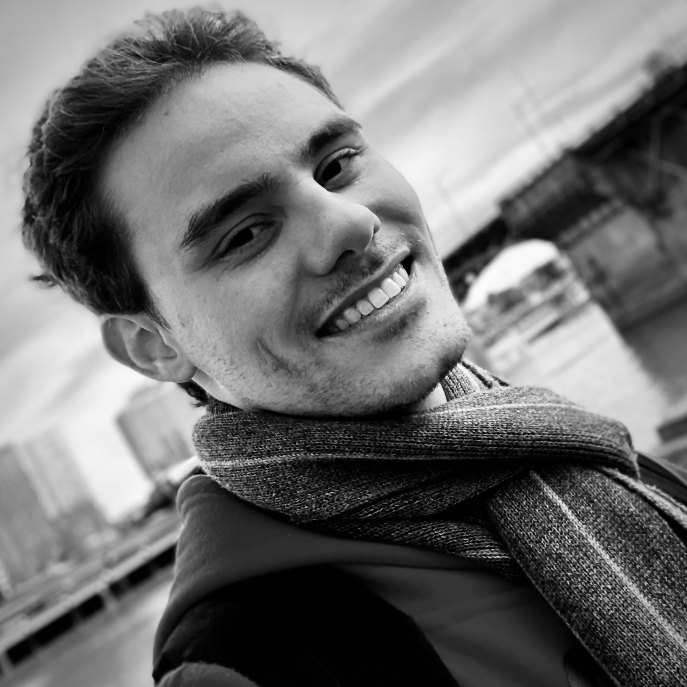

# About me

Hello, I am Pedro!

I am from Salvador, Bahia, Brazil, but I am currently pursuing my PhD in Computer Science in Tsukuba, Japan.

<!-- I left my hometown in 2015 in order to study Physics Engineering at the Federal University of São Carlos. While I was in São Carlos, I could dedicate my time to what I like the most: physics, mathematics, statistics and computer science (not necessarily in this order). Concurrently with the college studies, for two years I was a research assistant for [Embrapa Instrumentation](https://www.embrapa.br/instrumentacao) with a [FAPESP](http://www.fapesp.br/en/) scholarship studying Laser Induced Breakdown Spectroscopy, from which I wrote my undergraduate thesis. This experience was undeniably the one which made me closer to programming and data science. -->

<!-- Beyond that, I also invested my time in other activities while in college: I was a physics assistant instructor, I learned german, I attended theoretical physics and computer science conferences, I was the photographer for the CAASO Dance Company and a volunteer at Projeto Presença (Project for Presence), helping arrange meditation encounters throughout the city. Despite that, what I made the most while in Salvador and São Carlos were friends and memories. -->

At present, I am devoting myself to study subjects that sparked my interest, namely japanese and Deep Learning. 

Oh, and of course, I also keep this website, writing a somethings whenever possible.

## About the website

This site is a tool to organize subjects I wish to ponder and a reason for writing more frequently as well. In a nutshell, it's just a blog.

It is true that some posts could be taken as more professional albeit others are seen as personal. 

Anyway, I hope you like what you find here 😁.

## For you

That's right! This is for you, esteemed reader. As you may well have noticed, this website does not have (for now) a commenting section. However, if you've come this far, _worry no more_!

I can see that you're a kindred soul and wish to help me with **critics, suggestions, corrections, translations, ideas, designs, donations, blessings, peace messages, love letters, party invites, travel proposals, lottery tickets, marvelous ballads, youth spells, gifts and/or doubts**. To this end, the fastest and safest way is sending a carrier pigeon (we accept 🐦, 🦆, 🦜, 🦉, 🕊️ and 🦅), but in the event you are unable to fetch one, it is always possible to [send me an e-mail](mailto://vaz.valois@hotmail.com).

So far, these are the only ways to reach me, but soon more pigeons will be available 😉.